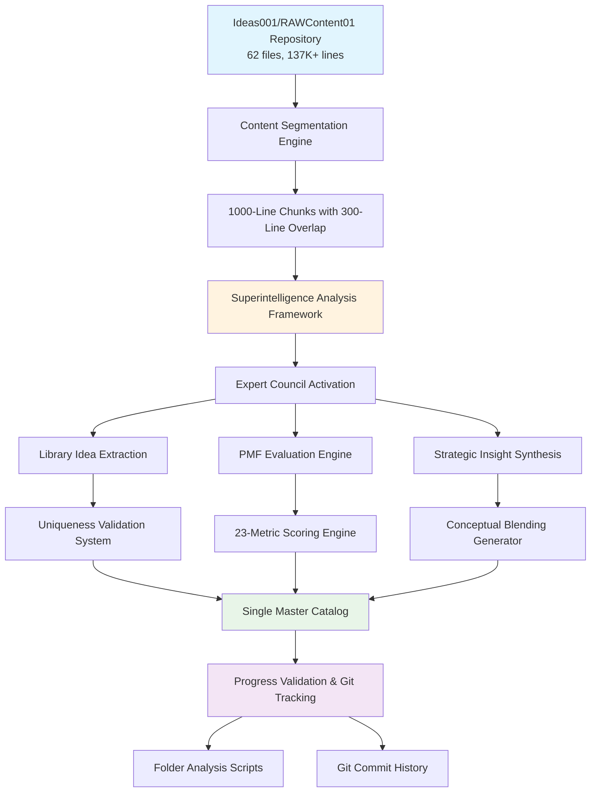
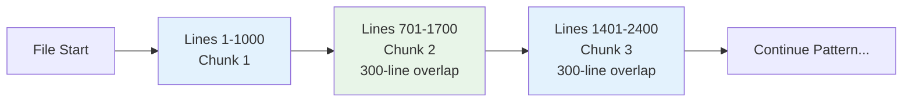
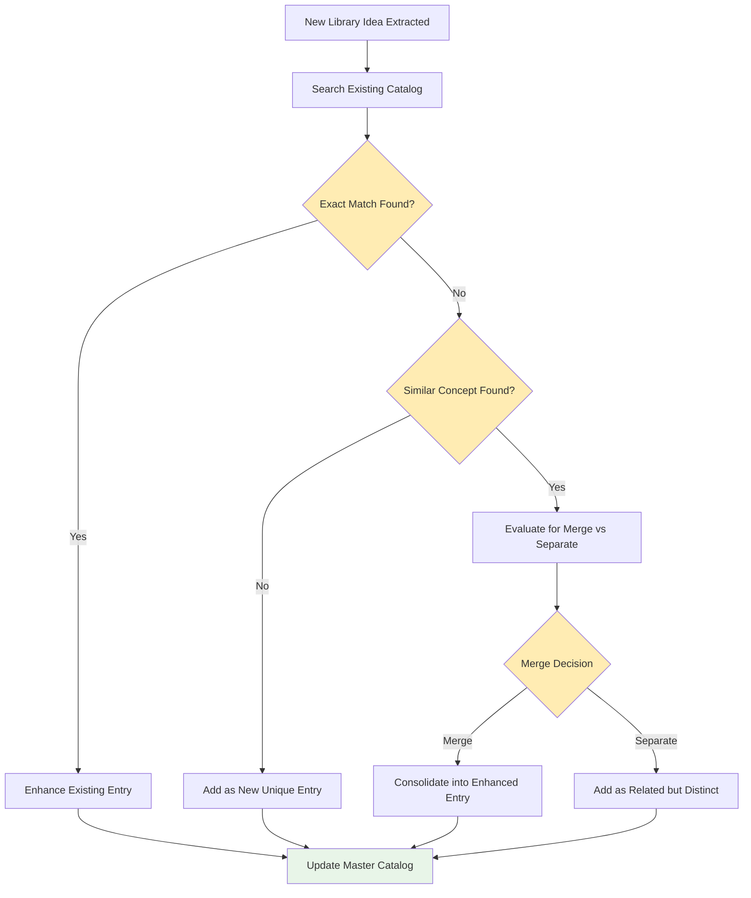
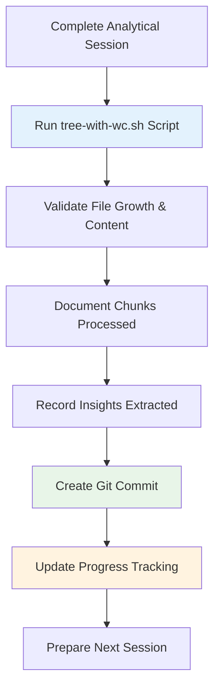

# Design Document

## Overview

This design outlines a systematic analytical framework for extracting high Product Market Fit (PMF) Rust library ideas from the Ideas001/RAWContent01 content repository. The system will methodically process 137,000+ lines across 62 files using 1000-line chunks with 300-line overlaps, apply the enhanced PMF evaluation framework with Shreyas Doshi strategic analysis, and maintain a single consolidated catalog with uniqueness validation and progress tracking.

## Architecture

### High-Level Analytical Architecture



### Analytical Processing Pipeline

The system follows a five-phase analytical pipeline:

1. **Content Segmentation & Overlap Management**: Break down files into 1000-line chunks with 300-line overlaps
2. **Superintelligence Analysis**: Apply IQ 1000 framework with expert council activation
3. **Library Extraction & PMF Evaluation**: Extract unique ideas and apply 23-metric scoring
4. **Consolidation & Uniqueness Validation**: Maintain single master catalog with duplicate prevention
5. **Progress Validation & Version Control**: Track progress with scripts and git commits

## Components and Interfaces

### 1. Content Processing and Chunking System

**Purpose**: Systematically process all 62 files with optimal chunk sizing and overlap management

**Processing Strategy**:
- **Chunk Size**: 1000 lines per analytical unit for optimal cognitive processing
- **Overlap Size**: 300 lines between chunks to prevent boundary insight loss
- **File Sequencing**: Process files in logical order based on content relevance and size
- **Context Preservation**: Maintain narrative continuity across chunk boundaries

**Chunk Management Process**:


**Deliverables**:
- Chunk inventory with source file mapping and line ranges
- Overlap region tracking for context continuity
- Progress log with analytical session documentation

### 2. Superintelligence Analysis Engine

**Purpose**: Apply rigorous analytical methodology using the IQ 1000 framework with expert council activation

**Analysis Framework Application**:

**Phase 0 - Meta-Cognitive Tuning**:
- Deconstruct each chunk for Rust library opportunities
- Identify core objectives and implicit assumptions
- Detect logical fallacies or weak premises
- Formulate optimized execution plan for the chunk

**Phase 1 - Cognitive Staging & Expert Council Activation**:
- **Rust Domain Expert**: Deep technical knowledge of Rust ecosystem and performance characteristics
- **Product Market Strategist**: Business positioning, market sizing, and competitive analysis
- **Implementation Architect**: Technical feasibility, complexity assessment, and development effort estimation
- **Developer Experience Specialist**: API design, ergonomics, and adoption pathway analysis
- **Skeptical Engineer (Mandatory)**: Challenge assumptions, identify risks, and validate claims

**Phase 2 - Multi-Perspective Exploration**:
- **Conventional Analysis**: Identify standard approaches to problems mentioned in content
- **Conceptual Blending**: Generate 3+ innovative approaches by fusing Rust concepts with distant domains
- **Structured Debate**: Expert council provides opening statements, Skeptical Engineer challenges, others respond
- **Synthesis**: Master Synthesizer integrates refined insights into cohesive library opportunities

**Phase 3 - Verification & Quality Assurance**:
- Generate 5-10 fact-checkable questions per major library opportunity
- Validate claims against available evidence and market data
- Identify inconsistencies or weaknesses in reasoning
- Refine and polish final library concepts

### 3. PMF Evaluation and Scoring System

**Purpose**: Apply comprehensive 23-metric evaluation framework to each unique library opportunity

**Scoring Engine Architecture**:

**Strategic Assessment Module** (6 metrics):
- PMF Score: Problem severity × Solution fit × Market timing
- Differentiation Score: Unique value proposition × Technical moats × Feature gaps
- Market Size Score: Developer population × Growth trajectory × Enterprise potential
- Competitive Advantage Score: First mover benefits × Network effects × Switching costs
- Adoption Velocity Score: Learning curve × Integration effort × Immediate value
- Network Effects Score: User-to-user value × Data effects × Platform effects

**Technical Assessment Module** (6 metrics):
- Rust Performance Advantage Score: Memory patterns × CPU optimization × Parallelization
- Memory Safety Value Score: Buffer overflow prevention × Use-after-free elimination × Data race protection
- Concurrency Benefit Score: Async patterns × Parallel processing × Lock-free algorithms
- Zero-Cost Abstractions Score: Compile-time optimization × Trait system utilization × Macro benefits
- Implementation Complexity Score: Algorithm complexity × Domain expertise × Integration points
- Maintenance Burden Score: API stability × Backward compatibility × Documentation needs

**Market Position Module** (6 metrics):
- Timing Score: Technology readiness × Market awareness × Competitive maturity
- Ecosystem Fit Score: Rust idioms × Crates.io integration × Toolchain compatibility
- Enterprise Appeal Score: Compliance support × Commercial viability × Integration complexity
- Developer Experience Score: API ergonomics × Error messages × Documentation quality
- Community Building Potential Score: Contribution opportunities × Learning curve × Extensibility
- Open Source Sustainability Score: Funding models × Maintainer support × Corporate backing

**Risk Assessment Module** (5 metrics):
- Technical Risk Score: Unproven algorithms × Platform dependencies × Performance unknowns
- Market Risk Score: Problem validation × User behavior changes × Economic sensitivity
- Execution Risk Score: Team expertise × Resource requirements × Timeline pressures
- Obsolescence Risk Score: Technology evolution × Standard changes × Platform shifts
- Competition Risk Score: Entry barriers × Incumbent advantages × Resource asymmetry

### 4. Uniqueness Validation and Consolidation System

**Purpose**: Maintain single master catalog with duplicate prevention and insight enhancement

**Uniqueness Validation Process**:


**Consolidation Criteria**:
- **Exact Duplicates**: Same problem domain, similar technical approach, identical market positioning
- **Similar Concepts**: Related problem space but different technical implementation or market focus
- **Enhancement Opportunities**: New insights that improve existing library concept scoring or implementation details

**Master Catalog Structure**:
```markdown
# Rust Library PMF Catalog

## Library: [Harry Potter Name]

### Core Information
- **Brief Description**: [Concise problem and solution description]
- **Utility Domain**: [Primary application area]
- **Market Need Justification**: [Evidence-based market opportunity]
- **LLM Implementation Prompt**: [Detailed development guidance]

### Strategic Assessment (All Scores 1-100)
[Complete 23-metric evaluation with scores and rationale]

### Implementation Metrics
- **Predicted Lines of Code**: X,XXX lines
- **Estimated Development Time**: X weeks
- **Core Dependencies Count**: X crates
- **API Surface Complexity Score**: X/100
- **Testing Ease Score**: X/100
- **Testing Rationale**: [Detailed testing approach explanation]

### Analytical Provenance
- **Source Content**: [File names and line ranges]
- **Extraction Session**: [Date and chunk information]
- **Expert Council Insights**: [Key debate outcomes]
- **Conceptual Blending**: [Innovation methodology applied]
```

### 5. Progress Validation and Version Control System

**Purpose**: Ensure systematic coverage with verifiable progress tracking and audit trail maintenance

**Progress Validation Workflow**:


**Git Commit Message Format**:
```
Analysis Session [N]: [File Name] Chunks [X-Y]

- Processed lines [start-end] with 300-line overlap
- Extracted [N] unique library opportunities
- Updated [N] existing entries with enhanced insights
- Total catalog size: [N] libraries
- PMF scores: [N] above 70, [N] above 80
- Next session: [File Name] starting line [X]
```

**Folder Analysis Integration**:
- **Pre-Session**: Baseline measurement of catalog size and content
- **Post-Session**: Validation of growth and content additions
- **Progress Reports**: Regular comprehensive analysis of analytical progress
- **Quality Checks**: Verification that all content is being systematically covered

## Data Models

### Analytical Session Tracking

**Session Management Structure**:
- Session identifier with timestamp and analyst information
- Source file inventory with processing status and line counts
- Chunk processing log with overlap regions and boundary management
- Extracted insight inventory with uniqueness validation results
- Progress metrics with coverage percentages and quality indicators

### Library Opportunity Data Model

**Core Library Concept**:
```rust
struct LibraryOpportunity {
    name: String,                    // Harry Potter inspired
    description: String,             // Brief problem/solution
    domain: String,                  // Utility domain
    market_justification: String,    // Evidence-based need
    implementation_prompt: String,   // LLM development guidance
    
    strategic_scores: StrategicAssessment,
    technical_scores: TechnicalAssessment,
    market_scores: MarketPosition,
    risk_scores: RiskAssessment,
    implementation_metrics: ImplementationMetrics,
    
    analytical_provenance: AnalyticalProvenance,
}
```

**Analytical Provenance Tracking**:
```rust
struct AnalyticalProvenance {
    source_files: Vec<String>,       // Originating content files
    line_ranges: Vec<(usize, usize)>, // Specific content locations
    extraction_session: String,      // Session identifier
    expert_insights: Vec<String>,    // Council debate outcomes
    conceptual_blends: Vec<String>,  // Innovation methodologies
    verification_questions: Vec<String>, // Fact-checking queries
}
```

## Error Handling

### Quality Assurance Framework

**Content Processing Validation**:
- Verify complete coverage of all 62 files without gaps or omissions
- Ensure 300-line overlaps maintain narrative continuity across chunks
- Validate that chunk boundaries don't split critical insights
- Confirm systematic progress through all 137,000+ lines of content

**Analysis Quality Checks**:
- Confirm superintelligence framework applied consistently to each chunk
- Verify expert council activation and meaningful contribution across all sessions
- Validate that verification questions are comprehensive and properly answered
- Ensure conceptual blending produces innovative and valuable library concepts

**Uniqueness Validation Integrity**:
- Prevent duplicate library entries through systematic catalog checking
- Ensure similar concepts are properly consolidated or differentiated
- Validate that enhanced entries maintain coherence and accuracy
- Confirm master catalog maintains logical organization and accessibility

### Quality Assurance Implementation

The system implements multiple validation layers:

1. **Input Validation**: Verify content file integrity and accessibility
2. **Process Validation**: Ensure analytical framework consistency across all chunks
3. **Output Validation**: Validate library opportunity completeness and scoring accuracy
4. **Progress Validation**: Use folder analysis scripts to verify systematic coverage

## Testing Strategy

### Analytical Framework Validation

**Superintelligence Framework Application**:
- Verify each chunk receives complete analytical treatment with all phases
- Confirm expert council activation produces meaningful insights and debates
- Validate conceptual blending generates innovative library opportunities
- Ensure verification questions comprehensively validate major claims

### Content Coverage Assurance

**Systematic Processing Verification**:
- Confirm all 62 files processed completely without gaps
- Validate 1000-line chunking with 300-line overlaps maintains continuity
- Ensure progress tracking accurately reflects completion status
- Verify source traceability links all library ideas to originating content

### Output Quality Validation

**Library Opportunity Completeness**:
- Validate all 23 PMF metrics properly scored with supporting rationale
- Confirm implementation metrics include realistic effort estimates
- Verify testing considerations include comprehensive strategies
- Ensure LLM prompts provide actionable development guidance

### Progress Tracking Integrity

**Version Control and Validation**:
- Confirm git commits accurately document analytical progress
- Validate folder analysis scripts properly measure content growth
- Ensure progress reports reflect actual coverage and insight extraction
- Verify audit trail maintains complete analytical session history

The testing strategy ensures comprehensive coverage of source material while maintaining analytical rigor and producing a coherent, actionable catalog of high-PMF Rust library opportunities with complete strategic intelligence documentation.